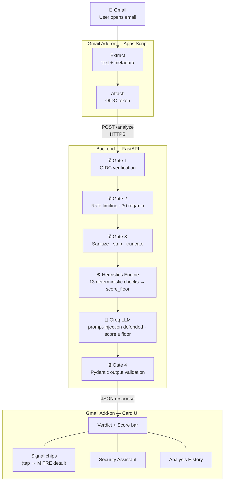

# ContextShield

> A Gmail Add-on that analyzes opened emails for malicious intent — producing a risk score, verdict, and plain-language reasoning, with an interactive security assistant built in.

[](https://github.com/NimrodNetzer/context-shield/actions/workflows/ci.yml)

---

## Overview

ContextShield turns every Gmail inbox into a security checkpoint. When you open an email, it automatically analyzes the message and shows:

- A **risk score** (0–100) with a visual bar
- A **verdict**: SAFE / SUSPICIOUS / MALICIOUS
- **Plain-language reasoning** — why the email was flagged
- **Tappable signal chips** — each one explains the specific threat it detected
- A **Security Assistant** — ask follow-up questions about the email directly in the sidebar
- An **Analysis History** — browse and manage previously analyzed emails

The core design principle:

> **Heuristics are the security engine. The LLM is the explainability layer.**

Security decisions are made by deterministic, auditable code. The LLM synthesizes signals into human-readable reasoning and catches subtle social engineering the rules miss. A `score_floor` from heuristics ensures the LLM can never be prompt-injected into downgrading a verdict.

---

## Architecture



---

## Features

### Email Analysis
- Automatic trigger when any email is opened
- Risk score 0–100 with filled/empty bar visualization (`■■■■■□□□□□`)
- Three-tier verdict: SAFE / SUSPICIOUS / MALICIOUS
- 3–5 plain-English reasoning bullets from the LLM
- Score floor enforced by heuristics — LLM cannot reduce it

### Signal Detection — 13 types mapped to MITRE ATT&CK

| Signal | What it catches | Severity | MITRE ATT&CK |
|---|---|---|---|
| `dkim_fail` | Email signature mismatch | High | T1566 · Phishing |
| `spf_fail` | Unauthorized sending server | High | T1566 · Phishing |
| `dmarc_fail` | Domain policy violation | High | T1566 · Phishing |
| `reply_to_mismatch` | Reply goes to different domain than sender | High | T1566 · Phishing |
| `display_name_spoofing` | Brand name in display, different domain in address | Critical | T1566 · Phishing |
| `homoglyph_domain` | Visually deceptive domain (paypa1.com, micrоsoft.com) | Critical | T1566 · Phishing |
| `dangerous_attachment` | Executable or macro-capable file extension | Critical | T1566.001 · Spearphishing Attachment |
| `suspicious_tld` | TLD statistically associated with abuse (.xyz, .tk) | High | T1566 · Phishing |
| `url_shortener` | Shortened URL hiding destination | Medium | T1566.002 · Spearphishing Link |
| `ip_as_hostname` | Raw IP address bypassing domain filters | High | T1566.002 · Spearphishing Link |
| `ssrf_risk_url` | Private/internal IP range in email link | Critical | T1190 · Exploit Public-Facing Application |
| `urgency_language` | Phishing language patterns ("verify now", "act immediately") | Low–Medium | T1566 · Phishing |
| `safe_browsing_hit` | URL found in Google's threat intelligence database | Critical | T1566.002 · Spearphishing Link |

Each signal chip is tappable — clicking opens a detail card explaining what the signal means, its MITRE ATT&CK technique ID, and the detected value.

### Security Assistant (Chat)
- Ask any question about the current email directly in the sidebar
- Full email context (snippet, verdict, signals) passed to the LLM automatically
- Conversation persists per email — switching emails starts a fresh chat
- Re-analyzing an email clears the previous conversation

### Analysis History
- Last 10 analyzed emails stored client-side in UserProperties (never on server)
- Dedicated history page with per-item and bulk delete
- Each history item shows verdict, score, sender, subject, and detected risks

### Google Safe Browsing Integration
- URLs extracted from email body checked against Google's threat database
- Same threat intelligence used by Chrome, Firefox, and Safari
- Fails open gracefully — analysis continues if API is unavailable

---

## Security Design

Every layer of the system treats email content as adversarial input.

### Threat Model → Mitigation

| Threat | Mitigation |
|---|---|
| Unauthenticated backend calls | Google OIDC token, audience exact-match to service URL |
| Token reuse / abuse | Per-identity rate limiting (30 req/min), not per-IP |
| Prompt injection via email body | XML delimiters, system/user role separation, explicit adversarial warning |
| LLM verdict manipulation | `score_floor` enforced in code — email content cannot override heuristics |
| Malformed LLM output | Pydantic schema validation + score/verdict consistency enforcement |
| SSRF via URL scanning | No DNS resolution; private IP blocklist; scheme allowlist |
| Attachment content leakage | Only filename sent — content never extracted or transmitted |
| API key exposure | Secret Manager only; never in source, image, or environment |
| Email content retention | Zero storage; only verdict + score + latency logged |
| Container privilege escalation | Non-root user; minimal `python:3.12-slim` base image |
| Oversized / fuzzing payloads | Strict field length limits; `extra=forbid` on all Pydantic models |

### Prompt Injection Defense (5 layers)

1. Email content placed in **user role only** — never in system prompt
2. Wrapped in `<untrusted_email_content>` XML delimiters
3. System prompt explicitly warns the model the content is adversarial
4. Heuristic signals placed in **system role** — unreachable by email content
5. `score_floor` enforced in `_parse_llm_response()` as hard code, independent of LLM output

### Score Architecture

The final score is a hybrid:
- **Heuristics** compute a `score_floor` from deterministic rules (e.g. DKIM fail → floor 40, all three auth headers fail → floor 75)
- **Groq LLM** returns a score ≥ `score_floor`, raising it if it detects additional threats
- **Verdict thresholds** are hard-coded: 0–39 SAFE, 40–69 SUSPICIOUS, 70–100 MALICIOUS
- The LLM's verdict string is ignored — verdict is always derived from the score

---

## Industry Security Standards

### MITRE ATT&CK

All 13 heuristic signals are mapped to [MITRE ATT&CK](https://attack.mitre.org/) techniques — the industry-standard taxonomy for cyber threats used by security teams worldwide.

| Technique | ID | Signals that detect it |
|---|---|---|
| Phishing | T1566 | dkim_fail, spf_fail, dmarc_fail, reply_to_mismatch, display_name_spoofing, homoglyph_domain, urgency_language |
| Spearphishing Attachment | T1566.001 | dangerous_attachment |
| Spearphishing Link | T1566.002 | url_shortener, ip_as_hostname, safe_browsing_hit |
| Exploit Public-Facing Application | T1190 | ssrf_risk_url |

Each signal chip in the UI shows the corresponding MITRE ATT&CK ID when tapped.

### OWASP Top 10 Alignment

The backend security design addresses the following [OWASP Top 10](https://owasp.org/www-project-top-ten/) categories:

| OWASP Category | How ContextShield addresses it |
|---|---|
| **A01 Broken Access Control** | OIDC token with exact audience match; subject allowlist; rate limiting per identity |
| **A02 Cryptographic Failures** | Email content never stored or transmitted beyond the analysis request; no PII retained |
| **A03 Injection** | Prompt injection defense: XML delimiters, role separation, adversarial warning; HTML stripped before processing |
| **A04 Insecure Design** | Threat model documented; security decisions delegated to deterministic code, not LLM |
| **A05 Security Misconfiguration** | Swagger UI disabled in production; CORS locked to mail.google.com; non-root container |
| **A06 Vulnerable Components** | All dependencies pinned to exact versions; minimal base image (python:3.12-slim) |
| **A09 Security Logging & Monitoring** | Structured logs on every request; email content never logged; verdict + latency only |

---

## Project Structure

```
ContextShield/
├── addon/
│   ├── appsscript.json     manifest, OAuth scopes, urlFetchWhitelist
│   ├── Code.gs             contextual trigger, payload builder, action handlers
│   ├── Api.gs              backend HTTP calls with OIDC token
│   ├── UI.gs               Card Service builders for all card states
│   └── History.gs          UserProperties-based analysis history
├── backend/
│   ├── main.py             FastAPI app, routes, security middleware
│   ├── auth.py             OIDC verification, per-identity rate limiter
│   ├── sanitizer.py        HTML stripping, Unicode normalization, truncation
│   ├── heuristics.py       13 deterministic signal checks, score_floor
│   ├── groq_client.py      Groq wrapper, prompt injection defense
│   ├── analyzer.py         two-stage orchestrator, LLM fallback
│   ├── chat.py             conversational assistant endpoint
│   ├── feedback.py         verdict correction logging
│   ├── safebrowsing.py     Google Safe Browsing API client
│   ├── models.py           Pydantic request/response schemas
│   ├── Dockerfile          non-root, multi-stage, minimal image
│   └── requirements.txt    pinned dependencies
├── tests/
│   ├── conftest.py         shared fixtures, TestClient setup
│   ├── unit/               sanitizer, models, heuristics, Groq client, Safe Browsing
│   └── integration/        /analyze, /chat, /feedback endpoint tests
├── .github/
│   └── workflows/ci.yml    GitHub Actions — tests + ruff lint on every push
├── cloudbuild.yaml         one-command Cloud Run deployment
├── DEVELOPMENT_NOTES.md    bugs found, fixes applied, lessons learned
└── README.md
```

---

## Running Locally

### Prerequisites

| Tool | Version | Notes |
|---|---|---|
| Python | 3.12 | Backend runtime |
| Node.js | any LTS | Required for `clasp` CLI |
| [Groq API key](https://console.groq.com) | — | Free tier, no credit card |
| [ngrok](https://ngrok.com) | — | Exposes local backend to Gmail |

---

### Step 1 — Start the backend

```bash
cd backend
python -m venv .venv

# Windows
.venv\Scripts\activate
# macOS / Linux
source .venv/bin/activate

pip install -r requirements.txt
```

Create `backend/.env`:

```env
GROQ_API_KEY=your-groq-api-key
GOOGLE_SAFE_BROWSING_KEY=your-safe-browsing-key   # optional
SERVICE_URL=                                        # leave empty for local dev
ALLOWED_SA_EMAILS=                                  # leave empty for local dev
```

```bash
uvicorn main:app --reload --port 8080
```

Verify: `curl http://localhost:8080/health` → `{"status":"ok"}`

---

### Step 2 — Expose via ngrok

Open a **second terminal**:

```bash
ngrok http 8080
```

Copy the `https://xxxx.ngrok-free.app` URL — needed in the next step.

---

### Step 3 — Deploy the Gmail Add-on

```bash
npm install -g @google/clasp
cd addon
clasp login
clasp create --type standalone --title "ContextShield"
clasp push
clasp deploy --description "v1"
```

> Update the ngrok URL constant in `addon/Api.gs`, then run `clasp push` again.

---

### Step 4 — Install in Gmail

1. Go to [script.google.com](https://script.google.com) → open **ContextShield**
2. Click **Deploy → Test deployments → Install**
3. Open any email in Gmail — the ContextShield panel appears automatically

---

### Running Tests

```bash
# From the project root
backend/.venv/Scripts/python -m pytest tests/ -v
```

**108 tests, all passing in under 1 second.**

| Test file | Tests |
|---|---|
| `tests/unit/test_sanitizer.py` | 12 |
| `tests/unit/test_models.py` | 15 |
| `tests/unit/test_heuristics.py` | 24 |
| `tests/unit/test_groq_client.py` | 16 |
| `tests/unit/test_safebrowsing.py` | 6 |
| `tests/integration/test_analyze_endpoint.py` | 11 |
| `tests/integration/test_chat_endpoint.py` | 5 |
| `tests/integration/test_feedback_endpoint.py` | 5 |

CI runs automatically on every push via GitHub Actions (tests + ruff lint).

---

## Production Deployment (Cloud Run)

```bash
# Store secrets
echo -n "your-groq-key" | gcloud secrets create groq-api-key --data-file=-
echo -n "your-sa@project.iam.gserviceaccount.com" \
  | gcloud secrets create allowed-sa-emails --data-file=-

# Deploy
gcloud builds submit --config cloudbuild.yaml
```

The `cloudbuild.yaml` builds a Docker image, pushes to Container Registry, and deploys to Cloud Run with `--no-allow-unauthenticated` enforced.

---

## API Reference

### `POST /analyze`
Analyzes an email. Authentication required (OIDC Bearer token).

**Request:**
```json
{
  "message_id": "string",
  "sender": "string",
  "reply_to": "string | null",
  "subject": "string",
  "body_plain": "string (max 16,000 chars)",
  "headers": { "spf": "pass|fail|...", "dkim": "pass|fail|...", "dmarc": "pass|fail|..." },
  "attachment_names": ["string"]
}
```

**Response:**
```json
{
  "score": 87,
  "verdict": "MALICIOUS",
  "reasoning": ["Reply-To differs from sender domain", "DKIM and SPF both fail"],
  "signals": [{ "type": "dkim_fail", "severity": "high", "value": null }],
  "analysis_source": "heuristics+llm"
}
```

### `POST /chat`
Answers a follow-up question about an analyzed email.

### `POST /feedback`
Records a verdict correction (false positive / false negative).

### `GET /health`
Liveness probe. No authentication required.

---

## Trade-offs & What I'd Do With More Time

**Trade-offs made:**

- **Groq (Llama 3.3-70b) over GPT-4** — sub-500ms inference makes the add-on feel instant. The heuristic layer compensates for the accuracy gap on subtle attacks.
- **ngrok over Cloud Run** — no billing account required for demo. Cloud Run config is ready (`cloudbuild.yaml`) — one command away from production.
- **In-process rate limiter** — simple and dependency-free. Would swap for Redis (`slowapi`) for multi-instance Cloud Run.
- **Filename-only attachment analysis** — attachment content never leaves the client (privacy boundary). A production version would send SHA-256 hashes to VirusTotal.
- **Apps Script UI constraints** — Card Service is visually limited (no custom CSS, no hover effects, no Enter-key submission). The trade-off for native Gmail integration with no publishing overhead.

**With more time:**

- Domain age lookup (WHOIS) — newly registered domains are a top phishing indicator
- VirusTotal integration for attachment hash and URL scanning
- Redis-backed rate limiter for multi-instance deployments
- Sender reputation memory — flag anomalies from known-safe senders
- Structured JSON logging with Cloud Logging alerts on MALICIOUS verdicts
